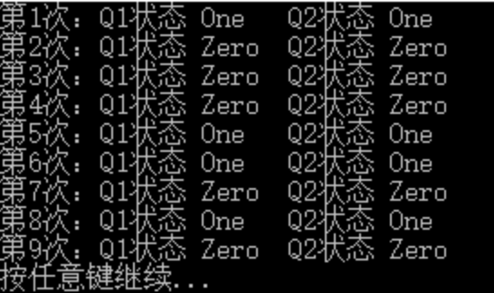

# 量子编程
#### 量子计算
所谓量子计算即利用量子力学现象来进行计算，例如量子叠加和量子纠缠。量子计算机是一种执行量子计算的设备。

传统比特位(bit)的状态非0即1，n bits的经典计算机只能一次运算2^n个数中的一个；而量子比特位(qubit)却可以处于0和1的叠加态(superposition)，2 qubits就可以叠加出4种态 00 01 10 11，以此类推，n qubits就可以一次性同时运算2^n个数。位数越多，量子计算的速度相较于经典计算机的速度会呈指数级增长。

量子编程语言包括命令式量子编程语言、函数式量子编程语言和多范式量子编程语言三类。命令式量子编程语言有 QCL、Quantum pseudocode、Q|SI>、Q language、qGCL、QMASM；函数式量子编程语言有 QFC 和 QPL、QML、LIQUi|>、Quantum lambda calculi、Quipper；Q# 属于多范式量子编程语言。

微软对Q＃的描述称之为“一种用于表达量子算法领域专用编程语言”。它被用于编写在一个附属量子处理器上执行的子程序，在一个经典主机程序和计算机的控制下。
借助 Visual Studio 的强大功能，将来使用 Q# 进行量子编程操纵量子比特，就像使用 C#、F# 或 C++ 等语言开发传统经典应用程序一样简单。

qubit: https://docs.microsoft.com/zh-cn/quantum/quantum-concepts-4-qubit?view=qsharp-preview

#### 示例
在 Q# 中是通过定义“操作”来获取或设置量子位状态的，在定义操作之前，我们需要先引入操作量子位的原语 Microsoft.Quantum.Primitive 命名空间，该命名空间定义了很多基本的量子逻辑门操作，例如：M()、X()、Z()、H()、CNOT() 等。  
在 Bell.qs 中定义一个 Set 操作，其作用非常简单，判断给定的量子位状态是否与期望的结果一致。如果一致，则啥也不做；若不一致，就将其进行翻转过来。代码如下所示：
```qs
operation Set(desired: Result, q1: Qubit) : ()
{
    body
    {
        // 测量（M）q1 量子位的状态
        let current = M(q1);

        if (desired != current)
        {
            // 如果有期望的不相等，将其进行翻转（X）
            X(q1);
        }
    }
}
```

下面定义一个操作 BellTest 来测试两个量子位的纠缠:
```qs
operation BellTest() : (Result, Result)
{
    body
    {
        // 用于保存量子位状态的可变局部变量
        mutable s1 = Zero;
        mutable s2 = Zero;

        // 分配两个量子位
        using (qubits = Qubit[2])
        {
            // 将第一个量子位执行阿达马门实现状态叠加
            H(qubits[0]);

            // 通过可控非门将两个量子进行纠缠
            CNOT(qubits[0], qubits[1]);

            // 测量两个量子位的状态
            set s1 = M(qubits[0]);
            set s2 = M(qubits[1]);

            // 释放量子位前需要将其重置0状态
            Set(Zero, qubits[0]);
            Set(Zero, qubits[1]);
        }

        // 返回两个量子位的状态
        return (s1, s2);
    }
}
```
上述操作分配了两个量子位，并对第一个量子位执行阿达马门 H 操作，使其处于叠加状态，然后通过可控非门 CNOT 将两个量子进行纠缠，最后分别测量两个量子的状态并以元组方式返回。

需要注意的是：使用 using 分配量子位后，会在程序离开结束的大括号 { 时进行自动释放，在释放时需要先将量子位状态重置为 0 状态。

#### 使用 C# 调用 Q# 操作
在 C# 驱动程序中，首先定义一个量子模拟器，然后循环 10 次测试两个量子位纠缠后的状态，并输出到控制台。具体代码如下所示：
```cs
static void Main(string[] args)
{
    using (var sim = new QuantumSimulator())
    {
        for (int i = 0; i < 10; i++)
        {
            var (s1, s2) = BellTest.Run(sim).Result;
            Console.WriteLine($"第{i}次：Q1状态 {s1,-5} Q2状态 {s2,-5}");
        }
    }

    Console.WriteLine("按任意键继续...");
    Console.ReadKey();
}
```
创建量子模拟器前需要导入 Microsoft.Quantum.Simulation.Simulators 命名空间，如果你的代码用到量子 Result 状态枚举，你还需要导入 Microsoft.Quantum.Simulation.Core 命名空间。



从运行结果可以看出，不管运行多少次，第一个量子位的状态始终与第二个量子位的状态保持一致。